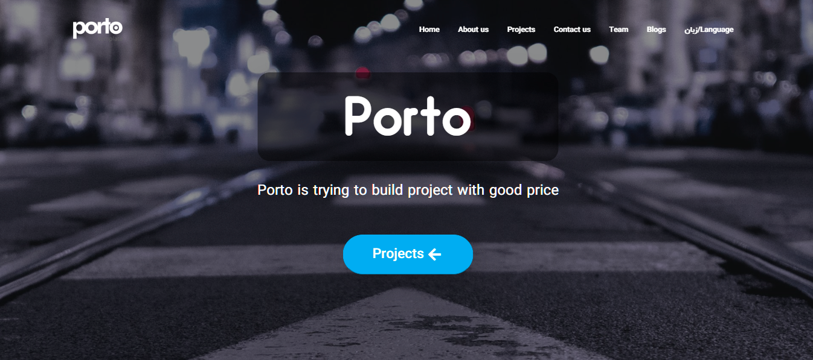

<a id="readme-top"></a>

[![Contributors][contributors-shield]][contributors-url]
[![Forks][forks-shield]][forks-url]
[![Stargazers][stars-shield]][stars-url]
[![Issues][issues-shield]][issues-url]
[![MIT][license-shield]][license-url]


<!-- PROJECT LOGO -->
<br />
<div align="center">
  <a href="https://github.com/Dimah-code/company-showcase-cms">

  

  </a>

<h3 align="center">A Modern ASP.NET Company Website with Admin Panel</h3>

  <p align="center">
    Porto is a modern ASP.NET-based website designed to help companies showcase their projects, team members, and brand more effectively, making it easier for customers to get familiar with your business.
    <br />
    <a href="https://github.com/Dimah-code/company-showcase-cms"><strong>Explore the docs »</strong></a>
    <br />
    <br />
    <a href="https://github.com/Dimah-code/company-showcase-cms/screenshots/SCREENSHOTS.md">View screenshots</a>
    &middot;
    <a href="https://github.com/Dimah-code/company-showcase-cms/issues/new?labels=bug&template=bug-report---.md">Report Bug</a>
    &middot;
    <a href="https://github.com/Dimha-code/company-showcase-cms/issues/new?labels=enhancement&template=feature-request---.md">Request Feature</a>
  </p>
</div>


<!-- TABLE OF CONTENTS -->
<details>
  <summary>Table of Contents</summary>
  <ol>
    <li>
      <a href="#about-the-project">About The Project</a>
      <ul>
        <li><a href="#built-with">Built With</a></li>
      </ul>
    </li>
    <li>
      <a href="#getting-started">Getting Started</a>
      <ul>
        <li><a href="#prerequisites">Prerequisites</a></li>
        <li><a href="#installation">Installation</a></li>
      </ul>
    </li>
    <li><a href="#usage">Usage</a></li>
    <li><a href="#roadmap">Roadmap</a></li>
    <li><a href="#contributing">Contributing</a></li>
    <li><a href="#contact">Contact</a></li>
    <li><a href="#license">License</a></li>
  </ol>
</details>


<!-- ABOUT THE PROJECT -->
## About The Project

[](screenshots/landing-page-screenshot.png)


Porto is a bilingual (English–Persian) ASP.NET website designed to help companies professionally present their projects, team members, and brand identity.
It features a comprehensive admin panel for managing all website content — including projects, team profiles, and blog posts — with full control over adding, editing, and deleting data.
Users can also send messages directly from the main website, which are displayed in the admin dashboard.

<p align="right">(<a href="#readme-top">back to top</a>)</p>


### Built With

### 🧩 Technologies & Tools Used

#### 🖥️ Backend
[](https://dotnet.microsoft.com/apps/aspnet/mvc)
[](https://dotnet.microsoft.com/)
[](https://learn.microsoft.com/dotnet/csharp/)
[](https://learn.microsoft.com/ef/ef6/)
[](https://www.hangfire.io/)

#### 🗄️ Database
[](https://www.microsoft.com/sql-server)
[](https://learn.microsoft.com/dotnet/csharp/programming-guide/concepts/linq/)

#### 🎨 Frontend
[](https://developer.mozilla.org/docs/Web/HTML)
[](https://developer.mozilla.org/docs/Web/CSS)
[](https://getbootstrap.com)
[](https://jquery.com)
[](https://developer.mozilla.org/docs/Web/Guide/AJAX)
[](https://fontawesome.com)

#### ⚙️ Tools & Environment
[](https://visualstudio.microsoft.com/)
[](https://www.nuget.org/)
[](https://www.iis.net/)
[](https://git-scm.com/)


<p align="right">(<a href="#readme-top">back to top</a>)</p>


<!-- GETTING STARTED -->
<!-- GETTING STARTED -->
## Getting Started 

Follow the steps below to set up and run the **Porto** project on your local machine.

### Prerequisites

Before starting, make sure you have the following installed:

- [Visual Studio 2019 or later](https://visualstudio.microsoft.com/)
- [.NET Framework 4.7](https://dotnet.microsoft.com/en-us/download/dotnet-framework)
- [SQL Server 2018 or later](https://www.microsoft.com/sql-server)
- [SQL Server Management Studio (SSMS)](https://learn.microsoft.com/en-us/sql/ssms/download-sql-server-management-studio-ssms)
- [Git](https://git-scm.com/)

### Installation

1. **Clone the repository**
   ```bash
   git clone https://github.com/Dimah-code/company-showcase-cms.git
   ```

2. **Open the project**

    Launch Visual Studio

    Open the cloned folder and load the .sln file

3. **Restore the database**

    Open SQL Server Management Studio (SSMS)

    Right-click on Databases → Restore Database

    Choose the provided .bak file from the project’s Database folder

    After restoring, verify the connection string in Web.config

4. **Configure the connection string**

    In Web.config, update the connection string with your SQL Server credentials if necessary:
```C#
<connectionStrings>
  <add name="DefaultConnection" 
       connectionString="Data Source=.;Initial Catalog=PortoDB;Integrated Security=True" 
       providerName="System.Data.SqlClient" />
</connectionStrings>
```

5. **Build and run the project**

    In Visual Studio, select the Porto project as the startup project

    Press F5 or click Start Debugging to run the site locally

### 🌐 Access

    Once the project is running, open your browser and go to:
```sh
https://localhost:xxxx/
```
(where xxxx is your local port number)

<p align="right">(<a href="#readme-top">back to top</a>)</p>


<!-- DEPLOYMENT -->
## 📦 Deployment

You can deploy **Porto** to any Windows-based hosting that supports **ASP.NET Framework 4.7** and **SQL Server**.

### 🏠 Option 1: Deploy to IIS (Local or Remote Server)

1. **Build the project**
   - In Visual Studio, set the build configuration to **Release**.
   - Go to `Build → Build Solution`.

2. **Publish the project**
   - Right-click the project in **Solution Explorer** → **Publish**.
   - Choose **Folder**, **IIS**, or **Web Deploy** depending on your host.
   - Configure:
     - Target location (local folder or remote server)
     - Connection settings (FTP, Web Deploy, or local IIS site)
   - Click **Publish**.

3. **Set up the database**
   - Open **SQL Server Management Studio (SSMS)**.
   - Restore the provided `.bak` file or run the migration scripts.
   - Update your connection string in `Web.config` on the server if needed.

4. **Configure IIS (if self-hosting)**
   - Open **IIS Manager**.
   - Add a new **Website** → set the physical path to your published folder.
   - Bind a port or domain name.
   - Ensure **.NET v4.0** is selected in **Application Pool**.
   - Click **Start** to launch the site.

Once completed, your website will be accessible via the configured domain or IP address.

---

<!-- USAGE EXAMPLES -->
## Usage

**Porto** helps companies manage and present their **projects, team members, and blog posts** in a bilingual (English–Persian) environment.

Key examples of use:
- Display company **projects** with descriptions and images.
- Showcase **team members** and their roles.
- Publish **blog posts** through the admin panel.
- Manage all content (add, edit, delete) easily through the dashboard.
- Allow users to send **messages** via the contact form — messages appear in the admin panel.

_For more screenshots and usage details._
<a href="https://github.com/Dimah-code/company-showcase-cms"><strong>Explore the docs »</strong></a>

<p align="right">(<a href="#readme-top">back to top</a>)</p>

<!-- ROADMAP -->
## Roadmap

- [ ] Admin Panel
    - [ ] Create, Delete and Edit Projects
    - [ ] Create, Delete and Edit Team members
    - [ ] Create, Delete and Edit Posts
    - [ ] Edit Website Texts
    - [ ] Get Client Messages
- [ ] Bilingual Support (English–Persian)
- [ ] Contact Form with Admin Inbox
- [ ] Responsive Redesign

See the [open issues](https://github.com/Dimah-code/company-showcase-cms/issues) for a full list of proposed features and known issues.

<p align="right">(<a href="#readme-top">back to top</a>)</p>

<!-- CONTRIBUTING -->
## Contributing

Contributions are welcome!

1. Fork the repo

2. Create a branch: 
```sh
git checkout -b feature/<short-description>
```

3. Make your changes and add tests where applicable

4. Commit:
```sh
git commit -m "feat: short description"
```

5. Push: 
```sh
git push origin feature/<branch>
```

6. Open a Pull Request

<p align="right">(<a href="#readme-top">back to top</a>)</p>

<!-- CONTACT -->
## Contact

👤 **Dimah**

- GitHub: [@Dimah-code](https://github.com/Dimah-code)
- Gmail: [@dimah.code@gmail.com](dimah.code@gmail.com)
- LinkedIn: [LinkedIn](in/hamidreza-ghareghani-b68b712b9)

<p align="right">(<a href="#readme-top">back to top</a>)</p>

<!-- LICENSE -->
## License

Distributed under the MIT License. See [MIT](/LICENSE.md) for more information.

<p align="right">(<a href="#readme-top">back to top</a>)</p>


[contributors-shield]: https://img.shields.io/github/contributors/Dimah-code/company-showcase-cms.svg?style=for-the-badge
[contributors-url]: https://github.com/Dimah-code/company-showcase-cms/graphs/contributors
[forks-shield]: https://img.shields.io/github/forks/Dimah-code/company-showcase-cms.svg?style=for-the-badge
[forks-url]: https://github.com/Dimah-code/company-showcase-cms/network/members
[stars-shield]: https://img.shields.io/github/stars/Dimah-code/company-showcase-cms.svg?style=for-the-badge
[stars-url]: https://github.com/Dimah-code/company-showcase-cms/stargazers
[issues-shield]: https://img.shields.io/github/issues/Dimah-code/company-showcase-cms.svg?style=for-the-badge
[issues-url]: https://github.com/Dimah-code/company-showcase-cms/issues
[license-shield]: https://img.shields.io/github/license/Dimah-code/company-showcase-cms.svg?style=for-the-badge
[license-url]: https://github.com/Dimah-code/company-showcase-cms/blob/master/LICENSE.md
